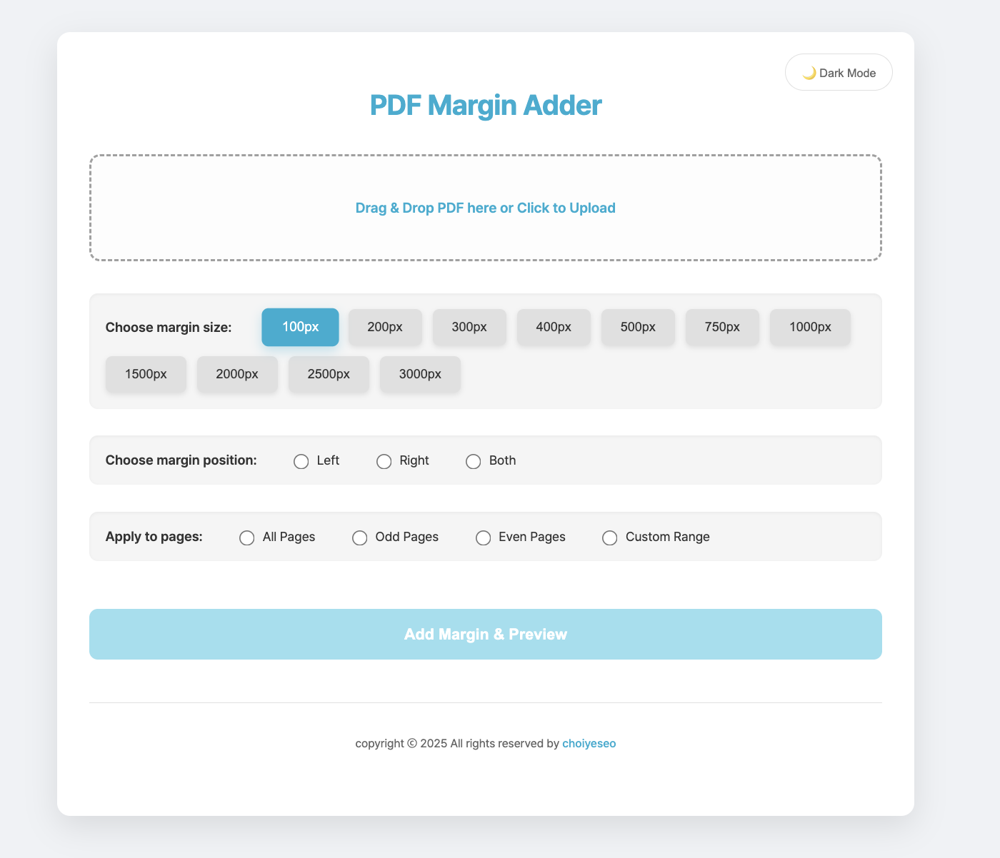

# 🚀 [PDF Margin Adder 바로가기](https://choiyeseo.github.io/pdf-margin-tool/)

---

## 📘 PDF Margin Adder?

PDF 문서에 원하는 위치에 여백을 추가해서 가독성과 인쇄 편의성을 높일 수 있는 **클라이언트 기반 웹 도구**

---

## 💡 주요 기능

- **여백 위치/크기 설정**  
  → 왼쪽 / 오른쪽 / 양쪽 선택  
  → 100px ~ 3000px 간격 제공

- **페이지 범위 지정**  
  → 전체 / 홀수 / 짝수 / 사용자 지정 (예: `1-5, 8`)

- **완전한 보안**  
  → 모든 PDF 처리는 브라우저에서 실행됨 (서버 전송 없음)

---

## 💻 기술 스택

- **React 19**
- **pdf-lib**
- **HTML / CSS**

---

## 🔗 배포 정보

- **배포 주소**: [https://choiyeseo.github.io/pdf-margin-tool](https://choiyeseo.github.io/pdf-margin-tool)
- **배포 방식**: GitHub Pages (`gh-pages` 사용)

## 📄 라이선스
비상업적 목적에 한하여 자유롭게 사용할 수 있습니다.
